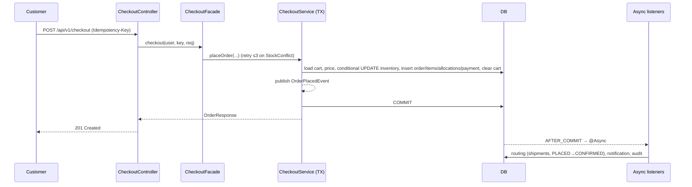

# 01 — Architecture

## Style

The system is a **modular monolith**: one Spring Boot app with one database, organised **package-by-feature**. Each feature owns its entities and exposes behaviour through its service. Other features call the service, never the repository.

## Layers per feature

```
Controller (HTTP, validation, auth annotations, DTO mapping)
   └─> Service (business rules, transactions, ownership, events)
         └─> Repository (Spring Data JPA)  ─> DB (H2 / PostgreSQL)
```

## Package tree (`com.ecommerce.oms`)

```
OmsApplication
common/
  config/        ClockConfig, AsyncConfig, OpenApiConfig, JpaAuditingConfig
  entity/        BaseEntity (id, createdAt, updatedAt)
  exception/     ApiException + subclasses, ErrorCode, GlobalExceptionHandler
  money/         Money (scale/rounding helpers)
  web/           PageResponse<T>
security/        SecurityConfig, JwtService, JwtAuthenticationFilter, AuthUser, RestAuthEntryPoint, RestAccessDeniedHandler
user/            User, Role, AuthController, UserService, AdminUserController
catalog/         Category, Product, CategoryController, ProductController (public), AdminCatalogController
warehouse/       Warehouse, AdminWarehouseController, WarehouseService
inventory/       Inventory, InventoryMovement, MovementType, InventoryService, InventoryRepository (atomic updates), AdminInventoryController
cart/            Cart, CartItem, CartController, CartService
pricing/         Coupon, CouponRedemption, CouponService, CouponValidator, PricingService, PriceQuote, AdminCouponController
order/           Order, OrderItem, OrderItemAllocation, OrderStatus, OrderStatusHistory, OrderStateMachine,
                 CheckoutController, CheckoutFacade (retry, no tx), CheckoutService (@Transactional),
                 AllocationPlanner, OrderService, OrderController, AdminOrderController, CancellationService
payment/         Payment, Refund, PaymentService (interface), MockPaymentService
fulfillment/     Shipment, ShipmentItem, ShipmentStatus, FulfillmentRoutingListener, ShipmentService, WarehouseShipmentController
returns/         ReturnRequest, ReturnItem, ReturnStatus, ReturnService, RefundCalculator, CustomerReturnController, WarehouseReturnController
notification/    Notification, NotificationListener, NotificationController
audit/           AuditLog, AuditListener, AdminAuditController
events/          OrderPlacedEvent, OrderStatusChangedEvent, OrderCancelledEvent, ShipmentStatusChangedEvent, ReturnStatusChangedEvent, RefundIssuedEvent, InventoryAdjustedEvent
seed/            DataSeeder (runs when app.seed.enabled=true and users table empty)
```

## Checkout request flow



## Transaction boundaries

| Operation | Transaction |
|---|---|
| Checkout | One TX in `CheckoutService.placeOrder`; the retry loop lives outside it, in `CheckoutFacade` |
| Shipment status update | One TX: shipment update + inventory deduct (on PACKED) + order status recompute + event |
| Cancellation | One TX: order + shipments + inventory release/restock + refund + coupon release + event |
| Return receive | One TX: return status + restock + refund + order item/status update + event |
| Async listeners | Each listener runs in its own `REQUIRES_NEW` TX on the `eventExecutor` thread pool |

## Configuration & profiles

| Profile | DB | Seed | Notes |
|---|---|---|---|
| *(default)* | H2 in-memory `jdbc:h2:mem:oms;MODE=PostgreSQL;DATABASE_TO_LOWER=TRUE;DEFAULT_NULL_ORDERING=HIGH` | on | Zero-setup run for reviewers. H2 console is off. |
| `postgres` | `${DB_URL}`, `${DB_USERNAME}`, `${DB_PASSWORD}` (Neon, `sslmode=require`) | on (only if empty) | `JWT_SECRET` required |
| `test` | H2 in-memory | off | Used by all tests |

Common settings:
- **UTC everywhere:**
  - JVM default timezone set to UTC in `main`
  - `hibernate.jdbc.time_zone=UTC`
  - `spring.jackson.time-zone=UTC`
  - ISO-8601 output, `Clock.systemUTC()`
  - `Instant` in all entities and DTOs
- `spring.jpa.hibernate.ddl-auto=validate` (Flyway owns the schema)
- `spring.jpa.open-in-view=false`
- `app.jwt.secret`, `app.jwt.ttl-minutes=60`
- `app.returns.window-days=7`
- `app.checkout.max-retries=3`
- `app.seed.enabled`

## Key technology choices

- **Spring Boot 3.5.x / Java 21:** a mature ecosystem, and records keep DTOs concise.
- **Spring Data JPA (Hibernate ORM) + Flyway:** a versioned, reviewable schema. `validate` catches drift between entities and SQL.
- **PostgreSQL (Neon):** real row-level locking and constraints, and managed with no local install. H2 in PostgreSQL mode gives tests and reviewers zero setup.
- **Spring events vs a broker:** the brief rules out distributed systems. Events keep checkout non-blocking with no extra infrastructure. The outbox + Kafka upgrade path is documented.
- **JWT (jjwt):** stateless, simple and testable. Not OAuth, as the brief requires.
