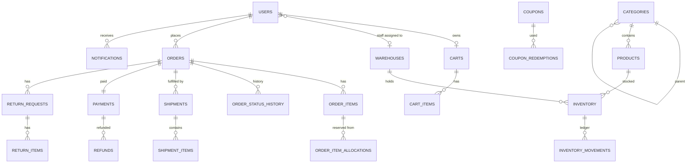

# 02 — Domain Model

All tables have:
- `id BIGINT GENERATED BY DEFAULT AS IDENTITY PRIMARY KEY`
- `created_at TIMESTAMP WITH TIME ZONE NOT NULL`
- `updated_at TIMESTAMP WITH TIME ZONE NOT NULL`

These are not repeated in the tables below. `version BIGINT NOT NULL DEFAULT 0` is listed wherever optimistic locking applies. Money columns are `NUMERIC(12,2)`; rates are `NUMERIC(5,2)`.

## ER overview

## Tables

### users (V2)

| column | type | constraints |
|---|---|---|
| email | VARCHAR(255) | NOT NULL, UNIQUE (stored lower-case) |
| password_hash | VARCHAR(100) | NOT NULL |
| full_name | VARCHAR(150) | NOT NULL |
| role | VARCHAR(30) | NOT NULL, CHECK in (`ADMIN`, `CUSTOMER`, `WAREHOUSE_STAFF`) |
| warehouse_id | BIGINT | FK → warehouses, NULL unless WAREHOUSE_STAFF (enforced in service). The FK is added in V4. |
| active | BOOLEAN | NOT NULL DEFAULT TRUE |

### categories (V3)

| column | type | constraints |
|---|---|---|
| name | VARCHAR(100) | NOT NULL |
| slug | VARCHAR(120) | NOT NULL, UNIQUE |
| parent_id | BIGINT | FK → categories, NULL = root |
| tax_rate | NUMERIC(5,2) | NOT NULL, CHECK 0–100 |
| active | BOOLEAN | NOT NULL DEFAULT TRUE |

### products (V3)

| column | type | constraints |
|---|---|---|
| sku | VARCHAR(64) | NOT NULL, UNIQUE |
| name | VARCHAR(200) | NOT NULL |
| description | TEXT | |
| category_id | BIGINT | NOT NULL FK |
| price | NUMERIC(12,2) | NOT NULL, CHECK > 0 |
| active | BOOLEAN | NOT NULL DEFAULT TRUE |
| version | BIGINT | |

Indexes: `(category_id)`, `(active)`, lower(name) if possible (otherwise plain name).

### warehouses (V4)

| column | type | constraints |
|---|---|---|
| code | VARCHAR(20) | NOT NULL, UNIQUE (e.g. `BLR-1`) |
| name | VARCHAR(100) | NOT NULL |
| city | VARCHAR(100) | NOT NULL |
| priority | INT | NOT NULL DEFAULT 100 |
| active | BOOLEAN | NOT NULL DEFAULT TRUE |

### inventory (V4)

| column | type | constraints |
|---|---|---|
| product_id | BIGINT | NOT NULL FK |
| warehouse_id | BIGINT | NOT NULL FK |
| on_hand | INT | NOT NULL DEFAULT 0, CHECK ≥ 0 |
| reserved | INT | NOT NULL DEFAULT 0, CHECK ≥ 0 |
| low_stock_threshold | INT | NOT NULL DEFAULT 5 |
| version | BIGINT | |

Additional constraints:
- `UNIQUE(product_id, warehouse_id)`
- **`CHECK (reserved <= on_hand)`**: the DB-level no-oversell safety net
- Available stock = `on_hand − reserved`

### inventory_movements (V4) — append-only

| column | type | notes |
|---|---|---|
| product_id, warehouse_id | BIGINT | NOT NULL FK |
| type | VARCHAR(30) | `STOCK_IN`, `ADJUSTMENT`, `RESERVE`, `RELEASE`, `PACK_DEDUCT`, `CANCEL_RESTOCK`, `RETURN_RESTOCK` |
| quantity | INT | signed delta of the affected column |
| reference_type | VARCHAR(30) | `ORDER`, `SHIPMENT`, `RETURN`, `MANUAL` |
| reference_id | BIGINT | |
| reason | VARCHAR(255) | |
| actor_id | BIGINT | user id, NULL for system |

### carts / cart_items (V5)

- **carts:** `customer_id` BIGINT NOT NULL UNIQUE FK.
- **cart_items:** `cart_id` FK, `product_id` FK, `quantity` INT CHECK 1–100, `UNIQUE(cart_id, product_id)`.

### coupons (V6)

| column | type | constraints |
|---|---|---|
| code | VARCHAR(40) | NOT NULL UNIQUE (stored upper-case) |
| description | VARCHAR(255) | |
| discount_type | VARCHAR(20) | `PERCENTAGE` or `FLAT` |
| discount_value | NUMERIC(12,2) | NOT NULL > 0; ≤ 100 if PERCENTAGE (service check) |
| max_discount | NUMERIC(12,2) | NULL = no cap |
| min_order_amount | NUMERIC(12,2) | NOT NULL DEFAULT 0 |
| category_id | BIGINT | NULL = all products. When set, applies to that category **and its descendants**. |
| valid_from, valid_to | TIMESTAMPTZ | NOT NULL, from < to |
| usage_limit | INT | NULL = unlimited |
| per_customer_limit | INT | NOT NULL DEFAULT 1 |
| used_count | INT | NOT NULL DEFAULT 0, CHECK used_count ≥ 0 |
| active | BOOLEAN | |
| version | BIGINT | |

### coupon_redemptions (V6)

- Columns: `coupon_id` FK, `customer_id` FK, `order_id` FK UNIQUE, `released` BOOLEAN DEFAULT FALSE.
- Released redemptions do not count toward limits.

### orders (V7)

| column | type | constraints |
|---|---|---|
| order_number | VARCHAR(30) | NOT NULL UNIQUE, `ORD-yyyyMMdd-XXXXXX` |
| customer_id | BIGINT | NOT NULL FK |
| status | VARCHAR(30) | NOT NULL (doc 04) |
| subtotal, discount_total, tax_total, grand_total | NUMERIC(12,2) | NOT NULL |
| coupon_code | VARCHAR(40) | NULL |
| ship_name, ship_line1, ship_line2, ship_city, ship_state, ship_pincode, ship_phone | VARCHAR | line2 is nullable |
| idempotency_key | VARCHAR(100) | NOT NULL |
| placed_at | TIMESTAMPTZ | NOT NULL |
| delivered_at, cancelled_at | TIMESTAMPTZ | NULL |
| version | BIGINT | |

Additional constraints: `UNIQUE(customer_id, idempotency_key)`; index `(customer_id, placed_at)`; index `(status)`.

### order_items (V7)

| column | type | notes |
|---|---|---|
| order_id, product_id | FK | |
| sku, product_name | VARCHAR | snapshot |
| unit_price | NUMERIC | snapshot |
| tax_rate | NUMERIC(5,2) | snapshot |
| quantity | INT | > 0 |
| line_subtotal, line_discount, line_tax, line_total | NUMERIC | doc 08 |
| returned_quantity | INT | NOT NULL DEFAULT 0, CHECK ≤ quantity |
| refunded_amount | NUMERIC | NOT NULL DEFAULT 0, CHECK ≤ line_total |

### order_item_allocations (V7)

- Columns: `order_item_id` FK, `warehouse_id` FK, `quantity` INT > 0, `UNIQUE(order_item_id, warehouse_id)`.
- This is the source of truth for where each reserved unit came from.

### order_status_history (V7)

- Columns: `order_id` FK, `from_status` (NULL for the first entry), `to_status`, `actor_id` (NULL = system), `note`.

### payments / refunds (V7)

- **payments:** `order_id` UNIQUE FK, `amount`, `method` (`MOCK`), `status` (`SUCCESS`), `transaction_ref` UNIQUE.
- **refunds:**
  - Columns: `payment_id` FK, `order_id` FK, `return_request_id` NULL FK (added in V10), `amount` > 0, `reason` (`CANCELLATION` or `RETURN`), `status` (`COMPLETED`), `transaction_ref`.
  - Invariant (service): sum(refunds.amount) ≤ payment.amount.

### shipments / shipment_items (V8)

- **shipments:**
  - Columns: `order_id` FK, `warehouse_id` FK, `status` (`PENDING`, `PACKED`, `SHIPPED`, `DELIVERED`, `CANCELLED`), `tracking_number` NULL, `packed_at`, `shipped_at`, `delivered_at`, `version`.
  - Constraints: `UNIQUE(order_id, warehouse_id)` (makes routing idempotent); index `(warehouse_id, status)`.
- **shipment_items:** `shipment_id` FK, `order_item_id` FK, `quantity`.

### return_requests / return_items (V10)

- **return_requests:**
  - Columns: `order_id` FK, `customer_id` FK, `warehouse_id` FK, `status` (`REQUESTED`, `APPROVED`, `REJECTED`, `REFUNDED`), `reason` VARCHAR(500) NOT NULL, `decision_note`, `decided_by`, `decided_at`, `received_by`, `received_at`, `refund_amount` NULL, `version`.
- **return_items:** `return_request_id` FK, `order_item_id` FK, `quantity` > 0, `restock` BOOLEAN NULL (set by staff on receive).

### notifications (V9)

Columns: `user_id` FK, `type` VARCHAR(50), `title`, `message` VARCHAR(1000), `reference_type`, `reference_id`, `read` BOOLEAN DEFAULT FALSE.

### audit_logs (V9)

Columns: `actor_id` NULL, `action` VARCHAR(60), `entity_type` VARCHAR(40), `entity_id` BIGINT, `details` TEXT (JSON string). Index `(entity_type, entity_id)`.

## Enums

- **Role:** `ADMIN`, `CUSTOMER`, `WAREHOUSE_STAFF`
- **OrderStatus:** `PLACED`, `CONFIRMED`, `PACKED`, `SHIPPED`, `DELIVERED`, `PARTIALLY_RETURNED`, `RETURNED`, `CANCELLED`
- **ShipmentStatus:** `PENDING`, `PACKED`, `SHIPPED`, `DELIVERED`, `CANCELLED`
- **ReturnStatus:** `REQUESTED`, `APPROVED`, `REJECTED`, `REFUNDED`
- **MovementType:** see the inventory_movements table
- **DiscountType:** `PERCENTAGE`, `FLAT`
- **RefundReason:** `CANCELLATION`, `RETURN`

## Migration order

| Migration | Contents |
|---|---|
| V1 | baseline (empty, or a comment) |
| V2 | users |
| V3 | categories, products |
| V4 | warehouses, inventory, movements, users.warehouse_id FK |
| V5 | carts |
| V6 | coupons |
| V7 | orders, items, allocations, history, payments, refunds |
| V8 | shipments |
| V9 | notifications, audit_logs |
| V10 | returns + refunds.return_request_id FK |
