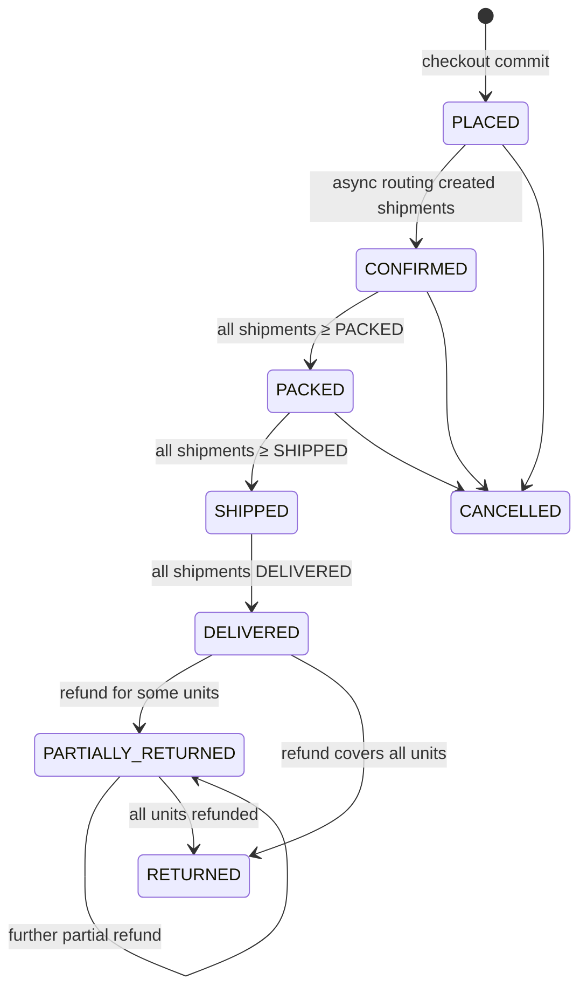

# 04 — Order, Shipment & Return State Machines

## Order statuses



The `OrderStateMachine` (pure class, unit-tested) holds an `EnumMap<OrderStatus, Set<OrderStatus>>` of allowed transitions:
- `assertCanTransition(from, to)` throws `INVALID_STATE_TRANSITION` if the move is not allowed.
- `OrderService.changeStatus(order, to, actor, note)` is the **only** place that sets `order.status`. It:
  1. validates the transition
  2. sets timestamps (`delivered_at`, `cancelled_at`)
  3. inserts `order_status_history`
  4. publishes `OrderStatusChangedEvent`

## Shipment statuses

```
PENDING → PACKED → SHIPPED → DELIVERED
PENDING / PACKED → CANCELLED   (only via order cancellation, not via the staff endpoint)
```

Staff can only move to the **next** status. Skipping steps, going backwards, or changing `DELIVERED`/`CANCELLED` shipments gives `INVALID_STATE_TRANSITION`.

Side effects in the same transaction:

| To | Effect |
|---|---|
| PACKED | For each shipment item, run the inventory `packDeduct(product, warehouse, qty)`: `on_hand −= q`, `reserved −= q`, movement `PACK_DEDUCT`. Set `packed_at`. |
| SHIPPED | `tracking_number` required; set `shipped_at` |
| DELIVERED | Set `delivered_at` |

After any shipment change, run `OrderService.recomputeFromShipments(order)`.

## Deriving order status from shipments

Consider only non-cancelled shipments and map each to a rank: `PENDING→CONFIRMED`, `PACKED→PACKED`, `SHIPPED→SHIPPED`, `DELIVERED→DELIVERED`. The order's target status is the **lowest** rank.

The order changes only if the target is *ahead* of the current status and the current status is one of CONFIRMED, PACKED or SHIPPED. For example, with two shipments at PACKED and SHIPPED, the order is `PACKED`. Once both are SHIPPED, the order is `SHIPPED`.

## Routing: PLACED → CONFIRMED (async)

`FulfillmentRoutingListener` handles `OrderPlacedEvent` (doc 07):
1. Load the order. If its status ≠ `PLACED` (for example, already cancelled), do nothing.
2. If shipments already exist, do nothing (idempotent; also `UNIQUE(order_id, warehouse_id)`).
3. Group `order_item_allocations` by warehouse and create one `PENDING` shipment per warehouse with its `shipment_items`.
4. Call `changeStatus(order, CONFIRMED, system)`.

## Cancellation

- **Who:** the owning customer or an admin.
- **Allowed from:** `PLACED`, `CONFIRMED`, `PACKED`. That means no shipment is SHIPPED or DELIVERED. Otherwise `ORDER_NOT_CANCELLABLE`.

Steps, in one transaction (with the order `@Version` guarding races against staff updates):
1. For each allocation:
   - If a shipment exists for that warehouse **and** it is `PACKED`: `on_hand += q`, movement `CANCEL_RESTOCK`.
   - Otherwise: release the reservation (`reserved −= q`), movement `RELEASE`.
2. Set all shipments to `CANCELLED`.
3. Refund `payment.amount − already refunded` with reason `CANCELLATION`.
4. Release the coupon: mark the redemption `released=true` and decrement `used_count` (guarded ≥ 0).
5. `changeStatus(order, CANCELLED, actor, reason)` and publish `OrderCancelledEvent`.

**Race:** if the routing listener runs after cancellation, step 1 of routing sees `CANCELLED` and exits.

## Return request statuses

```
REQUESTED → APPROVED → REFUNDED     (receive + refund happen together)
REQUESTED → REJECTED
```

- Approve/reject: staff of `return_requests.warehouse_id`, or an admin.
- Receive: only from `APPROVED`.
- Customer-side rules and refund math are in doc 09.
- Each change publishes `ReturnStatusChangedEvent`.

## Role → action matrix

| Action | CUSTOMER | WAREHOUSE_STAFF | ADMIN |
|---|---|---|---|
| Place order | own | – | – |
| Cancel order | own | – | any |
| Shipment PACKED/SHIPPED/DELIVERED | – | own warehouse | any |
| Request return | own delivered order | – | – |
| Approve/reject/receive return | – | own warehouse | any |
